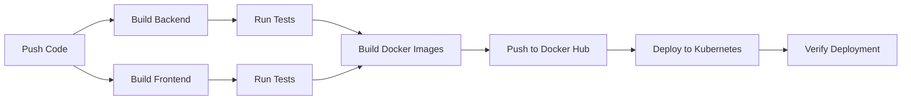

# 📱 Phone Book Application - Projet DevOps


Application de gestion de contacts avec architecture microservices, déployée sur Kubernetes avec pipeline CI/CD automatisé.

## 🏗️ Architecture

```
┌─────────────────────────────────────────────┐
│             KUBERNETES CLUSTER              │
│                                             │
│  ┌──────────┐  ┌──────────┐  ┌──────────┐   │
│  │ Frontend │  │ Backend  │  │  MySQL   │   │
│  │  (React) │  │ (Spring) │  │          │   │
│  │  x2      │  │  x2      │  │  x1      │   │
│  └──────────┘  └──────────┘  └──────────┘   │
│                                             │
│  ┌──────────┐  ┌───────────┐  ┌──────────┐  │
│  │  Redis   │  │Prometheus │  │ Grafana  │  │
│  │  Cache   │  │ Metrics   │  │Dashboard │  │
│  └──────────┘  └───────────┘  └──────────┘  │
│                                             │
│              ┌─────────────────┐            │
│              │ Ingress NGINX   │            │
│              └─────────────────┘            │
└─────────────────────────────────────────────┘
```

### Composants

- **Frontend** : React + Vite + TailwindCSS
- **Backend** : Spring Boot 3.5 + JPA + Security
- **Database** : MySQL 8.0
- **Cache** : Redis 7
- **Monitoring** : Prometheus + Grafana
- **Orchestration** : Kubernetes
- **CI/CD** : GitHub Actions

## 🚀 Démarrage Rapide

> **📖 [Guide de démarrage complet](QUICKSTART.md)** - Tout ce qu'il faut pour démarrer en 3 minutes

### Prérequis

- Docker & Docker Compose
- Kubernetes (minikube, kind, ou cloud)
- kubectl
- Node.js 20+
- Java 17+
- Maven 3.8+

### 1. Développement Local (Docker Compose)

```bash
# Cloner le repository
git clone https://github.com/kvill0780/phone-book-devops.git
cd phone-book

# Gestion des secrets (développement local)
# Copier les exemples, personnaliser et ne PAS commiter les secrets réels.
# Copier l'exemple d'env et le modifier localement :
cp .env.example .env

# Pour Kubernetes, copier le template des secrets (ou créer un secret via kubectl):
cp k8s/base/secrets.example.yaml k8s/base/secrets.yaml
# Recommandé : créer un secret directement (exemple avec openssl) :
# kubectl create secret generic mysql-secret \
#   --from-literal=MYSQL_PASSWORD="$(openssl rand -base64 16)" \
#   --from-literal=MYSQL_ROOT_PASSWORD="$(openssl rand -base64 16)" -n phone-book

# Lancer l'application
docker-compose up -d

# Accéder à l'application
# Frontend: http://localhost:8000
# Backend API: http://localhost:8080/api
# Grafana: http://localhost:3000
# Prometheus: http://localhost:9090
```

### 2. Déploiement Kubernetes

```bash
# Appliquer les manifests
cd k8s
./deploy.sh

# Ou manuellement
kubectl apply -f base/

# Vérifier le déploiement
kubectl get pods -n phone-book
kubectl get svc -n phone-book
```

### 3. Accès à l'application

Ajouter à `/etc/hosts` :
```
127.0.0.1 phone-book.local
```

URLs :
- **Application** : http://phone-book.local
- **API** : http://phone-book.local/api
- **Grafana** : http://phone-book.local/grafana (admin / admin)
- **Prometheus** : http://phone-book.local/prometheus

## 📁 Structure du Projet

```
projet-devops/
├── .github/
│   └── workflows/          # GitHub Actions CI/CD
│       ├── ci-cd.yml       # Pipeline principal
│       └── pr-check.yml    # Vérification PR
├── spring-phone-book/      # Backend Spring Boot
│   ├── src/
│   ├── Dockerfile
│   └── pom.xml
├── phone-book-frontend/    # Frontend React
│   ├── src/
│   ├── Dockerfile
│   └── package.json
├── k8s/                    # Manifests Kubernetes
│   ├── base/
│   │   ├── namespace.yaml
│   │   ├── configmap.yaml
│   │   ├── secrets.yaml
│   │   ├── mysql-deployment.yaml
│   │   ├── redis-deployment.yaml
│   │   ├── backend-deployment.yaml
│   │   ├── frontend-deployment.yaml
│   │   ├── prometheus-deployment.yaml
│   │   ├── grafana-deployment.yaml
│   │   └── ingress.yaml
│   ├── deploy.sh           # Script de déploiement
│   └── README.md
├── docker-compose.yml      # Développement local
├── prometheus.yml          # Configuration Prometheus
└── README.md
```

## 🔄 Pipeline CI/CD

### Workflow automatisé



### Déclencheurs

- **Push sur `main`** : Build + Test + Deploy
- **Push sur `develop`** : Build + Test
- **Pull Request** : Build + Test + Quality Checks

### Configuration

**IMPORTANT** : Pour activer le pipeline CI/CD complet, configurez les secrets GitHub :

1. **Docker Hub** (obligatoire) :
   - `DOCKER_USERNAME` : Votre username Docker Hub
   - `DOCKER_PASSWORD` : Token d'accès Docker Hub

2. **Kubernetes** (optionnel pour auto-deploy) :
   - `KUBE_CONFIG` : Votre kubeconfig encodé en base64

📖 **[Guide complet de configuration](.github/CICD-SETUP-GUIDE.md)**

## 🧪 Tests

### Backend
```bash
cd spring-phone-book
mvn test
```

### Frontend
```bash
cd phone-book-frontend
npm test
```

## 📊 Monitoring

### Accès
```bash
# Grafana (dashboards)
kubectl port-forward -n phone-book svc/grafana 3000:3000
# http://localhost:3000 (admin/admin)

# Prometheus (métriques)
kubectl port-forward -n phone-book svc/prometheus 9090:9090
# http://localhost:9090

# Générer du trafic pour tester
./generate-traffic.sh
```

### Dashboard Grafana
Dashboard pré-configuré : **"Phone Book - Application Overview"**
- HTTP Requests Rate
- Response Time (p95)
- JVM Memory Usage
- Active Pods
- Error Rate
- Database Connections (MySQL + Redis)

### Exporters
- **MySQL Exporter** : Métriques MySQL sur port 9104
- **Redis Exporter** : Métriques Redis sur port 9121
- **Spring Boot Actuator** : Métriques backend sur `/actuator/prometheus`

## 🔐 Sécurité

- **Secrets Kubernetes** : Mots de passe chiffrés
- **JWT Authentication** : Tokens sécurisés
- **Rate Limiting** : Protection contre brute force
- **HTTPS** : Ingress avec TLS (optionnel)
- **Network Policies** : Isolation des pods
- **RBAC** : Contrôle d'accès Kubernetes

## 📈 Scalabilité

### Scaling horizontal
```bash
# Scaler le backend
kubectl scale deployment backend --replicas=5 -n phone-book

# Scaler le frontend
kubectl scale deployment frontend --replicas=3 -n phone-book
```

### Auto-scaling (HPA)
```bash
kubectl autoscale deployment backend \
  --cpu-percent=70 \
  --min=2 \
  --max=10 \
  -n phone-book
```

## 🐛 Troubleshooting

```bash
# Vérifier l'état des pods
kubectl get pods -n phone-book

# Logs d'un pod
kubectl logs -f deployment/backend -n phone-book

# Décrire un pod (events, erreurs)
kubectl describe pod <pod-name> -n phone-book

# Entrer dans un pod
kubectl exec -it <pod-name> -n phone-book -- /bin/sh

# Vérifier les secrets
kubectl get secrets -n phone-book

# Redémarrer un deployment
kubectl rollout restart deployment/backend -n phone-book
```

## 🤝 Contribution

```bash
git checkout -b feature/ma-feature
git commit -m "feat: description"
git push origin feature/ma-feature
# Ouvrir une Pull Request sur GitHub
```

## 📝 Documentation

- **[README.md](README.md)** (ce fichier) - Vue d'ensemble et guide d'utilisation
- **[RAPPORT.md](RAPPORT.md)** - Rapport technique complet (5-10 pages)
- **[QUICKSTART.md](QUICKSTART.md)** - Démarrage rapide en 3 minutes
- **[.github/CICD-SETUP-GUIDE.md](.github/CICD-SETUP-GUIDE.md)** - Configuration du pipeline CI/CD

## 👥 Auteur

**Étudiant MIAGE L3** - Projet DevOps

## 📄 Licence

MIT License